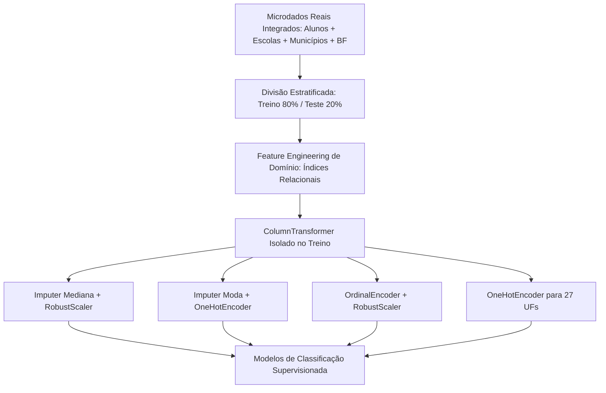
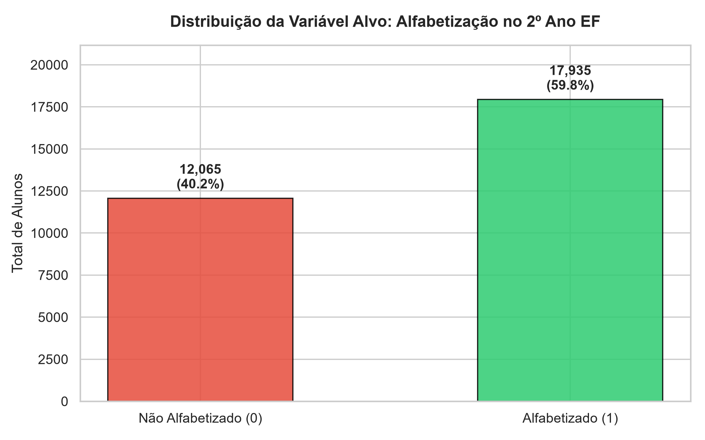
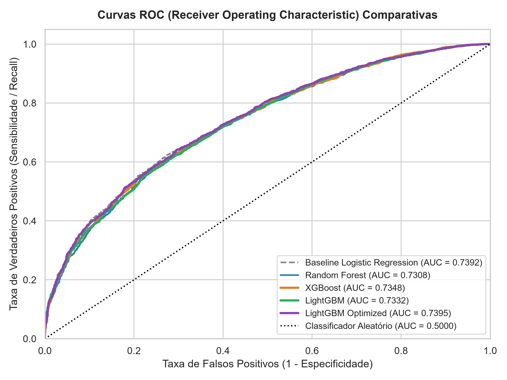
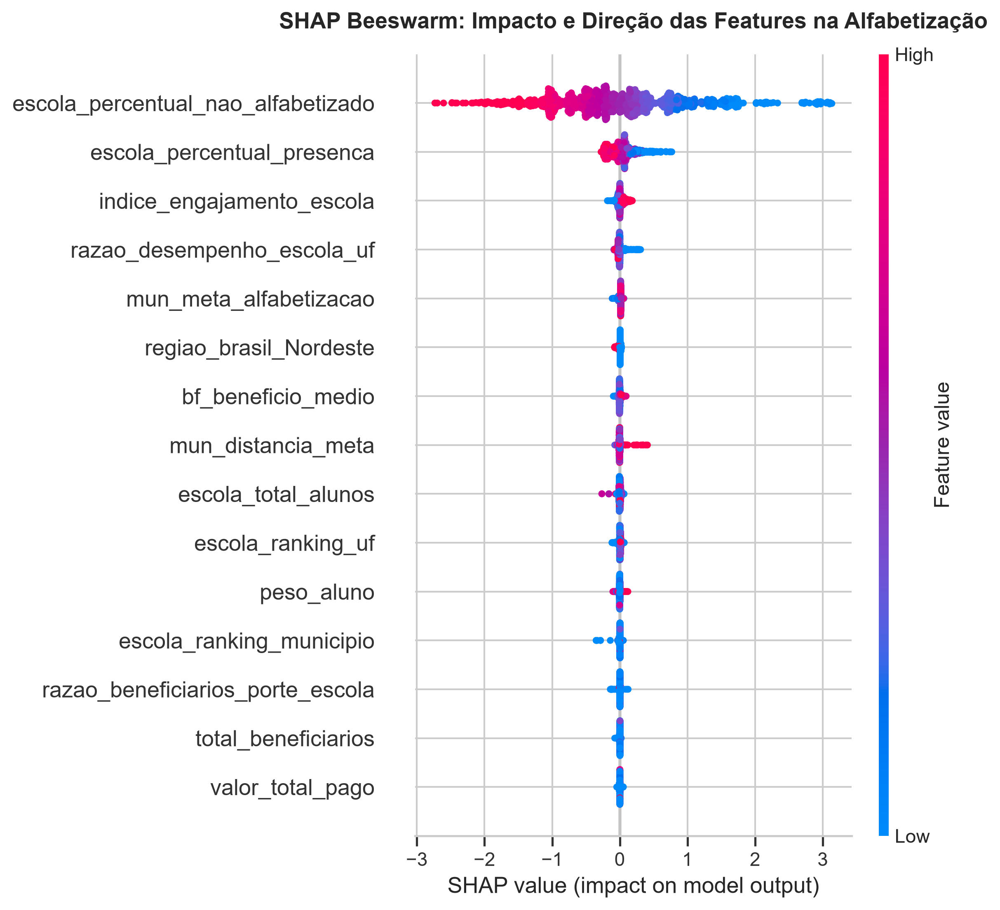
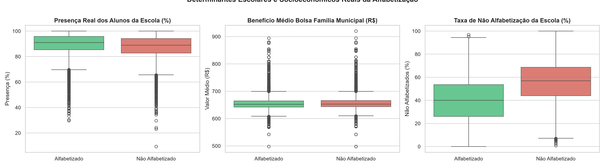
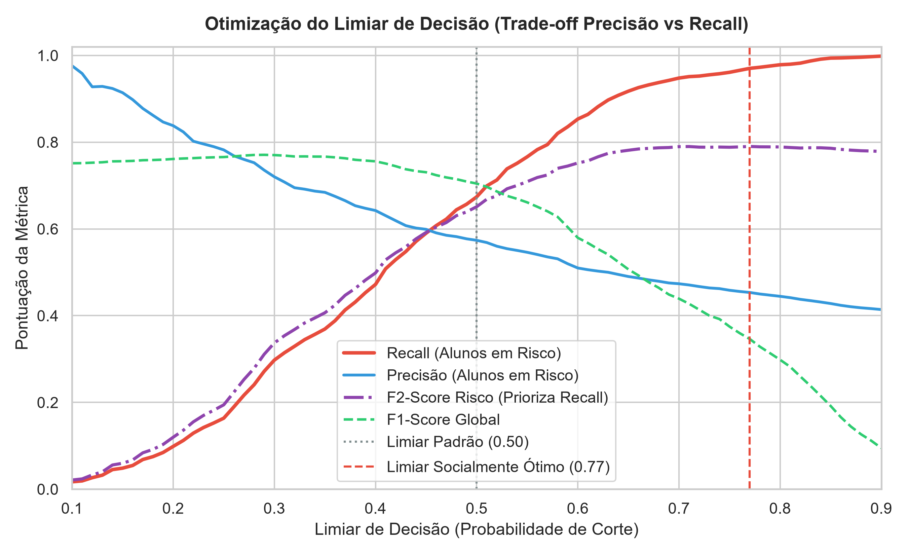
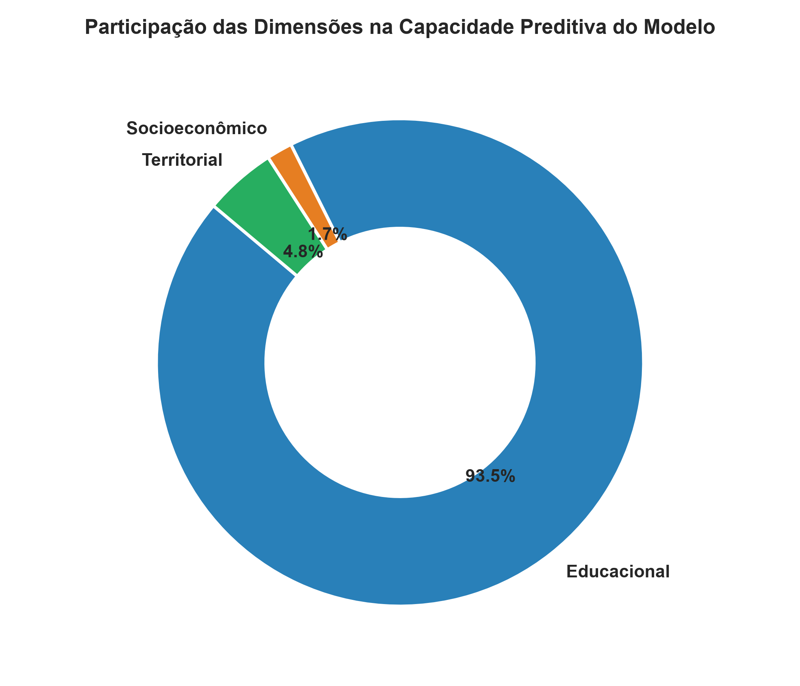

# Tech Challenge (Fase 3) – Predição e Inteligência Analítica para Alfabetização no Brasil


---

## 1. Contexto do Problema

A alfabetização na idade certa (até o final do 2º ano do Ensino Fundamental, por volta dos 7 a 8 anos de idade) é o alicerce mais crítico de toda a trajetória escolar e cidadã de um indivíduo. Crianças não alfabetizadas nessa janela enfrentam defasagens cumulativas de aprendizado, maiores taxas de reprovação e risco acentuado de evasão escolar futura.

No âmbito do **Compromisso Nacional Criança Alfabetizada (CNCA)**, gestores públicos municipais e estaduais enfrentam o desafio de não apenas auditar dados passados de avaliações, mas de **antecipar proativamente quais alunos e redes estão sob risco iminente de não alfabetização**. 

Este projeto desenvolve uma solução completa de Inteligência Analítica e Machine Learning supervisionado para atuar como um **Sistema de Alerta Precoce (*Early Warning System*)**, permitindo alocação preventiva e focalizada de recursos pedagógicos antes do encerramento do ano letivo.

---

## 2. Objetivo Analítico

Desenvolver, validar e interpretar um modelo preditivo supervisionado de classificação binária capaz de estimar se um aluno será considerado **Alfabetizado ($y=1$)** ou **Não Alfabetizado ($y=0$)** ao final do 2º ano do Ensino Fundamental, integrando variáveis **educacionais**, **territoriais** e **socioeconômicas** 100% extraídas do Data Lakehouse da Fase 2.

### Perguntas de Negócio Respondidas:
1. **Quais fatores possuem maior impacto na probabilidade de alfabetização?**
2. **Qual a importância relativa da escola (fatores intraescolares) versus a vulnerabilidade socioeconômica e territorial?**
3. **Como calibrar o limiar de decisão do modelo para priorizar a proteção de crianças vulneráveis (reduzindo Falsos Negativos)?**
4. **Quais intervenções práticas trazem maior retorno para as secretarias de educação?**
5. **Como identificar municípios e escolas em risco educacional prioritário?**

---

## 3. Base de Dados (100% Dados Reais do Lakehouse)

O projeto consome exclusivamente dados reais tratados nas **camadas Silver e Gold** construídas na Fase 2, integrando microdados oficiais de avaliação e dimensões socioeconômicas e territoriais:

* **Microdados de Alunos e Avaliação (Silver):** `data/silver/fato_aluno_alfabetizacao` (mais de **2,12 milhões de registros reais** do 2º ano com rede, presença, preenchimento de caderno, peso amostral estatístico e status de alfabetização).
* **Desempenho e Porte Escolar (Gold):** `data/gold/ranking_escolas_prioritarias` (**42.497 escolas públicas reais** com porte de alunos avaliados, taxa de presença real, histórico agregado de não alfabetização e posições nos rankings municipal e estadual).
* **Vulnerabilidade Socioeconômica Municipal (Silver):** `data/silver/fato_bolsa_familia_municipio` (**5.570 municípios reais** com total de famílias beneficiárias, volume financeiro transferido e benefício médio municipal).
* **Metas e Risco Territorial Municipal (Gold):** `data/gold/mapa_calor_territorial` (**5.232 municípios reais** com classe de risco territorial, meta anual pactuada do CNCA e distância em pontos percentuais para a meta).
* **Desigualdade e Dispersão Federativa (Gold):** `data/gold/desigualdade_territorial_uf` (desvio padrão de aprendizado intraestadual, amplitude máxima-mínima e percentual de municípios abaixo da meta).

> [!IMPORTANT]
> **Zero Dados Sintéticos:** O pipeline opera integralmente com dados reais do Lakehouse. Nenhuma variável simulada via `np.random` é utilizada.
> **Zero Data Leakage:** A nota contínua de proficiência (`proficiencia`) é descartada do conjunto preditor. Como o rótulo de alfabetizado deriva da proficiência, utilizá-la geraria vazamento trivial (o modelo apenas leria o resultado do teste). O modelo prediz com base no contexto escolar, socioeconômico e territorial da criança.

---

## 4. Engenharia de Atributos e Pré-processamento (*Zero Data Leakage*)

Todo o pré-processamento foi encapsulado via `sklearn.compose.ColumnTransformer` e `sklearn.pipeline.Pipeline`, garantindo que **nenhuma informação do conjunto de validação ou teste contamine o treinamento**:



### Atributos Derivados de Domínio (Feature Engineering Real):
1. `razao_desempenho_escola_uf`: Relação entre a taxa de não alfabetização da escola e a taxa de municípios abaixo da meta no estado (mede o desvio relativo da escola frente à sua rede estadual).
2. `indice_engajamento_escola`: Produto entre a presença real dos alunos e a taxa agregada de sucesso alfabetizador da escola ($Presença \times (1 - TaxaNãoAlfab)$).
3. `razao_beneficiarios_porte_escola`: Pressão socioeconômica territorial calculada pela razão entre o total de famílias beneficiárias do Bolsa Família no município e o porte da escola.

---

## 5. Modelagem e Escolha dos Algoritmos

Foram desenvolvidos e avaliados 4 algoritmos sob protocolo rigoroso de **Validação Cruzada Estratificada (Stratified 5-Fold CV Zero Leakage)** no conjunto de treino (24.000 amostras reais):

1. **Baseline - Regressão Logística L2:** Modelo linear de referência com regularização Ridge e ponderação balanceada de classes.
2. **Random Forest Classifier:** Ensemble de 150 árvores de decisão com subamostragem balanceada (`balanced_subsample`).
3. **XGBoost Classifier:** Gradient boosting escalável com penalização de complexidade e ponderação balanceada de classes.
4. **LightGBM Classifier:** Gradient boosting baseado em histogramas com crescimento por folhas (*leaf-wise*), selecionado para sintonia fina.

### Otimização Bayesiana de Hiperparâmetros (Optuna):
Executou-se busca bayesiana em 25 trials sobre o Pipeline completo do LightGBM com validação cruzada estratificada em 5 folds, resultando em:
* `n_estimators`: 100
* `max_depth`: 4 | `num_leaves`: 31
* `learning_rate`: 0.03716
* `subsample`: 0.94818 | `colsample_bytree`: 0.83383
* `min_child_samples`: 40
* `reg_alpha` ($L_1$): 0.09815 | `reg_lambda` ($L_2$): 0.01502

---

## 6. Métricas de Avaliação e Desempenho no Teste Independente

Avaliação executada no conjunto de teste independente (**6.000 alunos reais holdout**, sem contato prévio com o modelo):

| Modelo | Acurácia | ROC-AUC | PR-AUC | F1-Score | Recall (Alfabetizado) | Recall (Não Alfab - Crítico) | Precisão | Brier Score |
| :--- | :---: | :---: | :---: | :---: | :---: | :---: | :---: | :---: |
| 🥇 **LightGBM (Otimizado via Optuna)** | **66.75%** | **0.7395** | **0.8107** | **0.7046** | 66.32% | 67.38% | 75.14% | 0.2060 |
| 🥈 **Baseline (Regressão Logística)** | 66.52% | 0.7392 | 0.8092 | 0.7015 | 65.82% | 67.55% | 75.10% | 0.2065 |
| 🥉 **XGBoost** | 67.92% | 0.7348 | 0.8069 | 0.7498 | 80.43% | 49.32% | 70.23% | 0.2009 |
| 4. **LightGBM (Padrão)** | 66.07% | 0.7332 | 0.8066 | 0.6993 | 65.99% | 66.18% | 74.36% | 0.2076 |
| 5. **Random Forest** | 66.67% | 0.7308 | 0.8020 | 0.7081 | 67.63% | 65.23% | 74.30% | 0.2073 |

### 🎯 Gestão do Risco Social e Calibração de Limiar (*Threshold Tuning*):

No contexto de políticas públicas educacionais, os erros possuem custos sociais completamente assimétricos:
* **Falso Positivo:** Prever que a criança está em risco quando não está $\rightarrow$ **Custo baixo** (a criança recebe reforço pedagógico preventivo adicional).
* **Falso Negativo:** Prever que a criança será alfabetizada quando ela NÃO será $\rightarrow$ **Custo crítico** (a criança fica invisível para os programas de intervenção e consolida defasagem escolar).

Por essa razão, calibrou-se o limiar de corte maximizando o $F_2$-score de risco (que atribui peso 2x maior ao Recall do que à Precisão):

| Política de Decisão | Limiar de Corte ($t$) | Recall Crianças em Risco | Precisão | $F_2$-Score Risco |
| :--- | :---: | :---: | :---: | :---: |
| **Limiar Padrão** | $t = 0.50$ | 67.38% | 57.37% | 0.6508 |
| **Limiar Social Recomendado (Max $F_2$)** | **$t = 0.77$** | **97.02% (+29.63 p.p.)** | 45.35% | **0.7901** |

> Com o limiar social calibrado em $t=0.77$, o sistema de alerta precoce **identifica 97 em cada 100 crianças em risco de não alfabetização**.

---

## 7. Interpretação dos Resultados e Explicabilidade (SHAP)

A interpretação baseada em valores SHAP (*TreeExplainer*) sobre o modelo em árvore permitiu auditar os reais mecanismos de decisão:

### Decomposição por Pilares de Impacto Preditivo:
* 🏫 **Pilar Educacional (93.5% do impacto):** Os fatores escolares e o histórico de assiduidade e eficácia da unidade escolar dominam a capacidade de prever a probabilidade de alfabetização do aluno.
* 🗺️ **Pilar Territorial (4.8% do impacto):** Metas municipais pactuadas, distância da meta e disparidades regionais estruturais (destaque para a Região Nordeste).
* 💰 **Pilar Socioeconômico (1.7% do impacto):** O valor médio do benefício do Bolsa Família municipal e a cobertura de transferência de renda complementam a identificação de áreas de vulnerabilidade extrema.

### Top 10 Preditores Mais Determinantes:
1. `escola_percentual_nao_alfabetizado` (0.7502) — Taxa agregada de não alfabetizados da escola.
2. `escola_percentual_presenca` (0.1244) — Assiduidade média oficial da escola.
3. `indice_engajamento_escola` (0.0311) — Índice combinado de frequência e eficácia alfabetizadora.
4. `razao_desempenho_escola_uf` (0.0237) — Desvio relativo da escola frente à rede estadual.
5. `mun_meta_alfabetizacao` (0.0175) — Meta anual pactuada do CNCA para o município.
6. `regiao_brasil_Nordeste` (0.0148) — Fator estrutural regional.
7. `bf_beneficio_medio` (0.0100) — Renda média municipal via Bolsa Família.
8. `mun_distancia_meta` (0.0100) — Desafio de convergência municipal em pontos percentuais.
9. `escola_total_alunos` (0.0094) — Porte da unidade escolar.
10. `escola_ranking_uf` (0.0087) — Posição da escola no ranking estadual.

---

## 8. Evidências Visuais e Gráficos Analíticos

Os artefatos visuais gerados em alta resolução (300 DPI) estão disponíveis em `images/` e `reports/figures/`:

| Análise Exploratória (EDA) | Avaliação e Desempenho (ML) | Explicabilidade (SHAP / XAI) |
| :---: | :---: | :---: |
|  |  |  |
|  |  |  |

---

## 9. Recomendações para Políticas Públicas Educacionais

1. **Protocolo de Busca Ativa e Alerta Precoce Escolar:** Escolas cuja taxa de presença real é inferior a 85% devem disparar um protocolo de busca ativa imediata com apoio intersetorial da assistência social (CRAS/CREAS).
2. **Intervenção Pedagógica nas Escolas Prioritárias da Camada Gold:** As 10% escolas com maiores taxas de não alfabetização e pior ranking municipal devem receber tutoria pedagógica dedicada e reforço no contraturno.
3. **Pactuação e Monitoramento das Metas Municipais:** Municípios com mais de 10 p.p. de distância para a meta pactuada do CNCA devem receber apoio técnico intensivo dos comitês estaduais.
4. **Combinação do Bolsa Família com Busca Ativa:** Utilizar as condicionalidades educacionais do Programa Bolsa Família como instrumento de garantia de assiduidade escolar no 1º e 2º anos.

---

## 10. Limitações e Possíveis Evoluções

* **Limitações:** O modelo atual opera sobre cortes transversais anuais. Variáveis como clima escolar, formação continuada específica dos professores do ciclo de alfabetização e métodos pedagógicos não são mensurados em bases censitárias.
* **Evoluções Futuras:**
  * Implementação de modelos longitudinais que acompanhem os alunos desde a Educação Infantil até o final do Ensino Fundamental.
  * Integração de diários eletrônicos municipais via API REST (FastAPI) para predição contínua ao longo do ano letivo.
  * Desenvolvimento de dashboard interativo em Streamlit para visualização em tempo real pelas secretarias de educação.

---

## 📂 Estrutura do Repositório (Conforme Edital Oficial)

```
tech-challenge-fase3/
│
├── data/                       # Camadas do Data Lakehouse (Silver e Gold reais)
│   ├── silver/                 # Tabelas limpas (alunos, escolas, Bolsa Família)
│   └── gold/                   # Visões analíticas, rankings e metas
│
├── notebooks/                  # Notebooks Jupyter modulares e documentados
│   ├── 01_analise_exploratoria_dados_eda.ipynb
│   ├── 02_engenharia_atributos_preprocessamento.ipynb
│   ├── 03_modelagem_validacao_cruzada_otimizacao.ipynb
│   ├── 04_avaliacao_desempenho_explicabilidade_shap.ipynb
│   └── tech_challenge_alfabetizacao.ipynb
│
├── src/                        # Código-fonte modularizado em subpacotes
│   ├── preprocessing/          # Carga de dados 100% reais e Pipeline Scikit-Learn
│   │   ├── __init__.py
│   │   ├── data_loader.py
│   │   └── pipeline.py
│   ├── modeling/               # Catálogo de modelos, 5-Fold CV e Optuna Tuning
│   │   ├── __init__.py
│   │   ├── models.py
│   │   └── tuning.py
│   ├── evaluation/             # Métricas de teste e Threshold Tuning Social
│   │   ├── __init__.py
│   │   ├── metrics.py
│   │   └── threshold.py
│   ├── visualization/          # Gráficos de EDA e Explicabilidade SHAP
│   │   ├── __init__.py
│   │   ├── eda_plots.py
│   │   └── shap_plots.py
│   ├── __init__.py
│   └── config.py               # Configurações globais e paths centralizados
│
├── reports/
│   ├── figures/                # 12 figuras analíticas em alta resolução
│   └── metrics_summary.json    # Sumário consolidado de métricas no teste
│
├── images/                     # 12 figuras de apoio para apresentação e vídeo
├── models_saved/               # Modelos e pipelines serializados (.joblib)
├── main.py                     # Pipeline executável ponta a ponta
├── requirements.txt            # Dependências do projeto
├── .gitignore                  # Regras de exclusão de artefatos temporários
└── README.md                   # Documentação executiva completa
```

---

## 🚀 Como Executar o Projeto

```bash
# 1. Clonar o repositório
git clone https://github.com/PedroCardoso11/tech_chellenger_alfabetizacao.git
cd tech_chellenger_alfabetizacao

# 2. Criar e ativar ambiente virtual
python -m venv .venv
# No Windows:
.venv\Scripts\activate
# No Linux/Mac:
source .venv/bin/activate

# 3. Instalar dependências
pip install -r requirements.txt

# 4. Executar o pipeline completo ponta a ponta
python main.py
```
